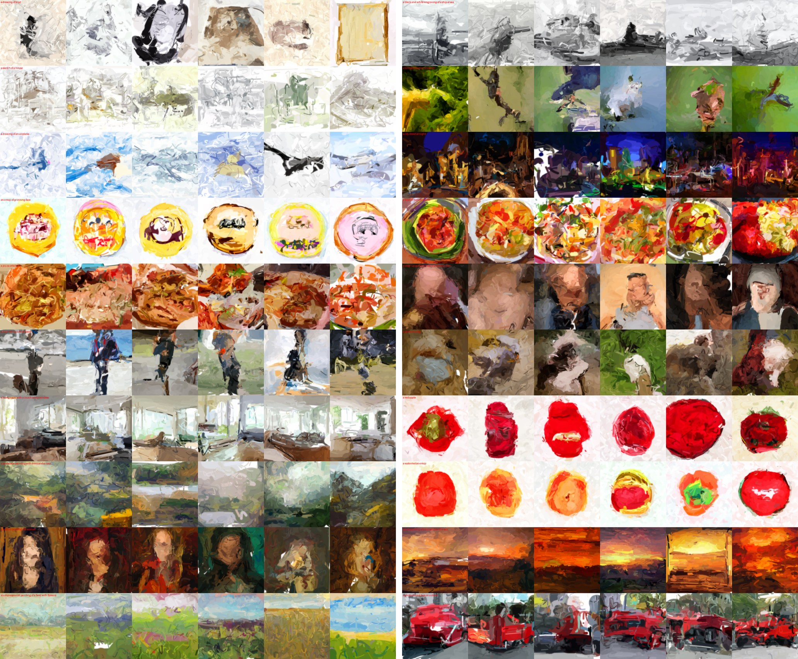
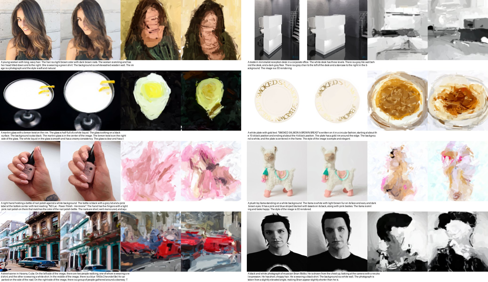
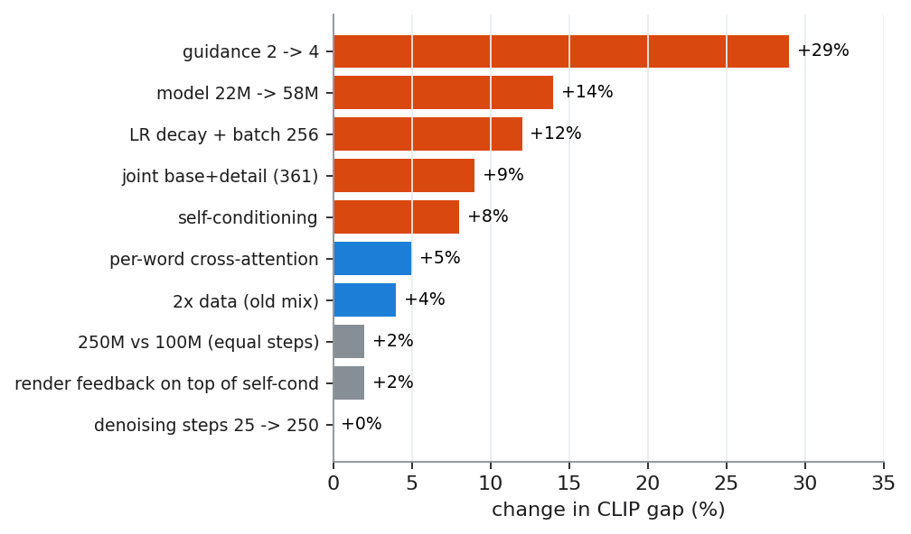
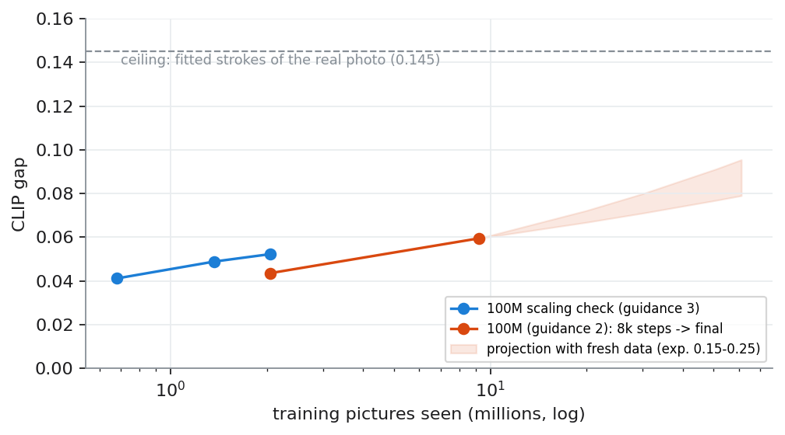

# Piccaso

**Is it easier for a model to paint a picture than to make one?**

Image generators predict hundreds of thousands of pixel values. A painter makes a few hundred brush strokes. Piccaso started as pure
curiosity: what happens if a small model answers a text prompt with **361 brush strokes** instead of pixels?

This repo is the full, open record of finding out: every angle we tried, what failed, what worked, the numbers, and where it could go.
The result so far is **Piccaso-0.1**, a 102M-parameter text-to-stroke diffusion model trained for about $65 of rented GPU time in total.

> **Early research preview.** Piccaso-0.1 is under-trained by any image-model standard (232k images, ~1 hour on 8 consumer GPUs for the
> final run). It paints convincing light, colour and layout, and objects some of the time. Interesting, honest, not a product yet.


*Unfiltered samples. Every tile is a render of 361 vector strokes.*

## Links

- **Paper / report:** [`paper/piccaso-0.1.pdf`](paper/piccaso-0.1.pdf)
- **Weights:** [huggingface.co/shing-dev/Piccaso-0.1](https://huggingface.co/shing-dev/Piccaso-0.1)
- **Lab notebook:** [`notebook/`](notebook/) (19 notes, in order, every plan, result and decision)

## The idea in one picture

A real photo, its 361 fitted strokes, and two Piccaso-0.1 paintings made from the caption alone (captions the model never saw):



Why strokes:

- **The output is a real vector painting.** It re-renders sharp at any size and exports to SVG. Every stroke is editable.
- **The process is the animation.** Big strokes first, detail last.
- **It is tiny.** One painting is 361 strokes x 11 numbers, about 4k numbers.
- **The catch:** a few hundred opaque strokes can't do photographic detail. The ceiling is a quick oil sketch, by design.

## Results

| Caption retrieval among 200 (top-1) | Real photo | Fitted 361 strokes (ceiling) | **Piccaso-0.1** |
|---|---|---|---|
| Seen: training captions | 96.5% | 83.5% | **28.5%** |
| **Unseen: held-out captions** | 98.0% | 87.5% | **31.0%** |
| DOCCI: other photo source, human captions | 80.0% | n/a | **9.5%** |

Chance is 0.5%. Same score on seen and unseen captions: it generalises, it does not memorise.

| StrokeBench (200 fixed prompts) | A1 (22M, old data) | B-58M (old data) | **Piccaso-0.1** |
|---|---|---|---|
| Right object, top-5 of 80 | 45.0% | 50.6% | **56.3%** |
| Right colour | 82.5% | 80.0% | **96.9%** |
| Both objects in two-object prompts | 2.5% | 3.8% | 4.4% |

Speed: 0.11 s per painting on an RTX 5090, about 93 s on a laptop CPU (no GPU, 25 steps).

## What we learned

1. **Representation decides learnability.** A GPT writing strokes number by number produced scribbles. 361 anchored stroke slots
   (coarse 4x4, 7x7, 10x10 grids plus a 14x14 detail layer), each with an on/off bit and a fixed direction, made it learnable.
2. **Diffusion over the whole set beats stroke-by-stroke.** Same data, every scale: set diffusion revises every stroke at every step;
   the one-stroke-at-a-time painter compounds its mistakes.
3. **Measure the ceiling first.** Score the *fitted* strokes of real images. If the format can't show it, no model can.
4. **The cheap levers were the big ones.** Guidance 2 -> 4: +29%. A missing learning-rate decay: +12%. Self-conditioning: +8%.
   Generating base and detail strokes jointly: +7-10% (faces +64%). Denoising steps 25 vs 250: nothing.
5. **Caption quality beat data volume.** 35% of our first dataset had captions that describe nothing a painting can show. Switching to
   PixelProse (dense Gemini captions) plus a "survives strokes" filter changed everything.
6. **100M beat 25M; 250M barely beat 100M** at equal steps on 232k images. Bigger needs more data.



## How it compares to a real image model

It doesn't, yet, and mostly not because of strokes. MobileDiffusion (Google) trained on **150M** images with weeks of TPU time;
Piccaso-0.1 saw **232k** images for about 8 GPU-hours. The learning curves were still rising when the budget ran out:



Projection with fresh data (uncertain, +/-30%): +500k images and 50k steps (~$55-60) should take held-out top-1 from 11% to roughly
17-22% of 1,000 captions. See Section 10 of the paper.

## Try it

```bash
pip install torch open_clip_torch ftfy regex safetensors huggingface_hub pillow
cd src
python paint.py "a lighthouse on a cliff at sunset, oil painting" --n 4 --out paintings
```

Writes a 512 px PNG and the real SVG (361 `<path>` strokes) per painting. Downloads the weights and the Long-CLIP-B text encoder
(~600 MB) on first run.

## Repo map

| Path | What |
|---|---|
| `paper/` | the report (PDF + HTML source) and `make_figures.py` |
| `notebook/` | the lab notebook: design doc, prior work, every experiment plan and result (00-18) |
| `src/batched.py`, `src/detail_level.py` | differentiable stroke renderer (base + windowed detail layer) |
| `src/extract_v3.py`, `src/extract_v2.py`, `src/extract_prod.py` | image -> 361 strokes (fitting) |
| `src/pp_manifest.py`, `src/pp_score.py`, `src/pp_merge.py` | PixelProse pipeline + "survives strokes" filter |
| `src/strokegen.py` | both generators (set diffusion and stroke-by-stroke), training, multi-GPU |
| `src/strokebench.py`, `src/diag_eval.py`, `src/eval_final.py` | evaluation |
| `src/paint.py`, `src/export_hf.py` | inference (PNG + SVG) and the Hugging Face export |
| `src/experiments/` | earlier experiments: format benchmarks, the failed GPT gate, memorisation test, detail model, captioning |
| `runbooks/` | the shell scripts that drove the 8-GPU runs |
| `results/`, `figures/` | final evaluation outputs and every figure |

## What's next

Few-step distillation (laptop and phone speed), more PixelProse data (8M more usable images), a 512 px finishing layer with a small
cascade "finisher" model, variable stroke opacity and softness, and a hierarchy-aware network. Details and costs in the paper.

## Credits

Data: [PixelProse](https://huggingface.co/datasets/tomg-group-umd/pixelprose) (CC-BY-4.0 captions),
[DOCCI](https://huggingface.co/datasets/google/docci) (test only). Text encoder: [Long-CLIP](https://github.com/beichenzbc/Long-CLIP)
(Apache-2.0, vendored in `src/longclip/`). Research run by Shreyash Kumar Singh with an AI coding agent (Claude).

Code: MIT. Weights: CC-BY-4.0.
